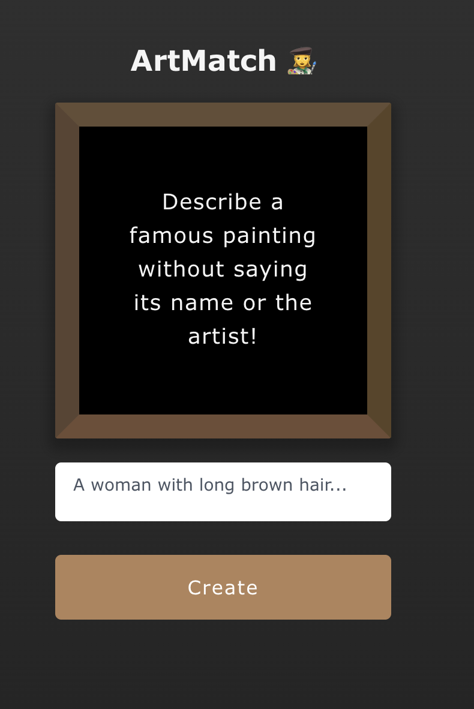

# ArtMatch - AI Image Generator

ArtMatch is a Next.js web application that generates unique artwork using AI. Simply enter a text prompt describing what you want to create, and get a custom AI-generated image powered by OpenAI's DALL-E model.

## Features

- Clean, modern UI with gallery layout
- Text-to-image generation
- Download generated images in high resolution
- Mobile-friendly responsive design
- Save and share your creations

## Getting Started

1. Clone the repository
2. Install dependencies:

env :

```
OPENAI_API_KEY=XXXX
```

