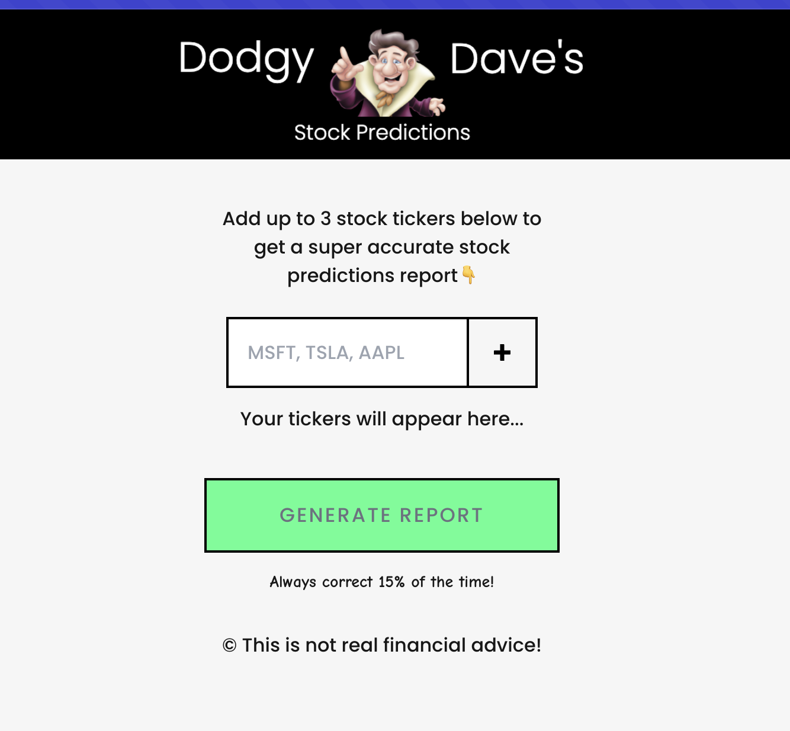

# Stock Prediction App

This project is a fun stock prediction application built following the [AI Engineer Path tutorial on Scrimba](https://scrimba.com/the-ai-engineer-path-c02v/~03). It's built with Next.js and allows users to:

- Enter up to 3 stock tickers
- Fetch real stock data from the Polygon.io API
- Generate a report with a recommendation and analysis of the stocks by OpenAI

## Getting Started

1. Clone this repository
2. Create a `.env` file and add your Polygon.io API key:

```
POLYGON_API_KEY=XXXX
OPENAI_API_KEY=XXXX
```

Need to have the url on cloudflare worker or move back to server action to call openai.
Look at directory ai_app/openai-api-worker


