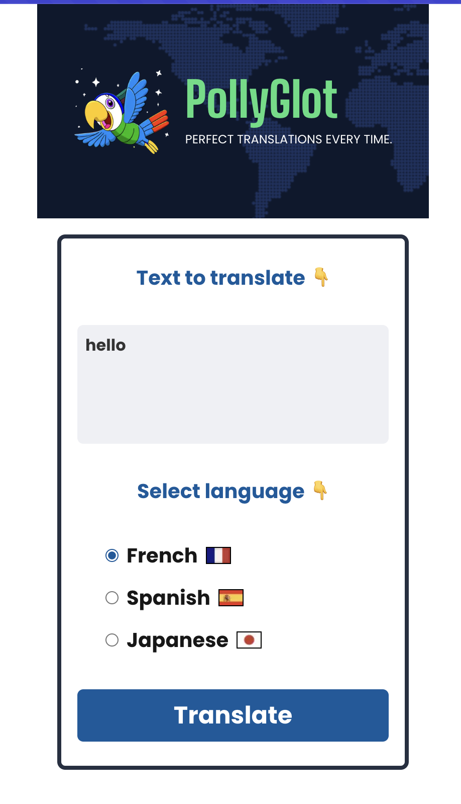

# PollyGlot - Perfect Translations Every Time

[PollyGlot](https://scrimba.com/the-ai-engineer-path-c02v/~0o) is a Next.js web application that provides instant translations between English and multiple languages including French, Spanish, and Japanese.
Powered by OpenAI's GPT-3.5 model, it delivers high-quality translations with a simple and intuitive interface.

## Features

- Clean, modern UI with a world map background and parrot mascot
- Support for translating between English and:
  - French 🇫🇷
  - Spanish 🇪🇸
  - Japanese 🇯🇵
- Real-time translation using OpenAI's GPT-3.5
- Mobile-friendly responsive design
- Easy one-click "Start Over" functionality

## Getting Started

1. Clone the repository
2. Install dependencies:

```bash
npm install
```

env :

```
OPENAI_API_KEY=XXXX
```

3. Run the development server:

```bash
npm run dev
```

Open [http://localhost:3000](http://localhost:3000) with your browser to see the result.


